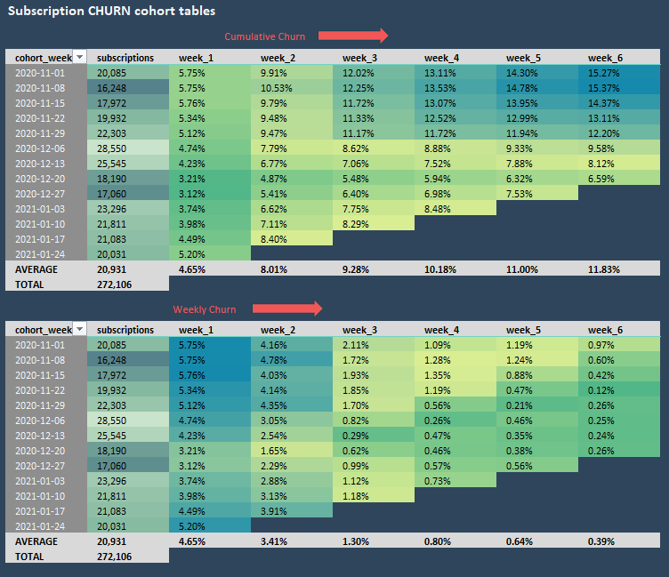

### Why Customer Cohort Analysis Matters

Customer cohort analysis helps businesses measure retention (how many customers stay) and churn (how many leave) over time. By grouping customers based on their sign-up date or first purchase, companies can:
- Identify trends: Spot whether newer customers stay longer than older ones.
- Improve retention: Pinpoint when customers typically leave and intervene.
- Optimize marketing: Measure which campaigns bring the most loyal customers.
- Boost revenue: Retaining customers is often cheaper than acquiring new ones.

---

## 📊 Project Description
This project analyzes weekly retention rates for user cohorts, tracking how many subscribers remain active over 6 weeks after their initial sign-up. The goal is to:
- Identify patterns in user drop-off.
- Provide actionable insights to reduce churn.

---

## ⚙️ Methodology 
1️⃣ **Data Extraction**  
   - Pull user sign-up dates and weekly activity logs.  

2️⃣ **Data Cleaning**  
   - Remove duplicates; handle missing values.  

3️⃣ **Cohort Creation**  
   - Group users by sign-up week.  

4️⃣ **Retention Analysis**  
   - Calculate `(Active Users / Cohort Size) * 100` per week.  

5️⃣ **Visualization**  
   - Generate heatmaps in Excel/Python. 

---  
## ✅ Findings
---
## 🎯 Recommendations

# 📊 Customer Cohort Analysis  

## 📄 Project Description  
*What problem does this solve?*  

## 🌐 Overview  
*Big-picture context...*  

## 🎯 Objectives  
- Retention analysis  
- Churn reduction  

## 📊 Dataset  
*Source, size, and variables...*  

## 🔎 Methodology  
*Cohort tables, Excel formulas...*  

## 📌 Key Findings  
- "Cohort X has 20% higher retention..."  

## 📈 Recommendations  
- "Launch a loyalty program for Month 2..."  