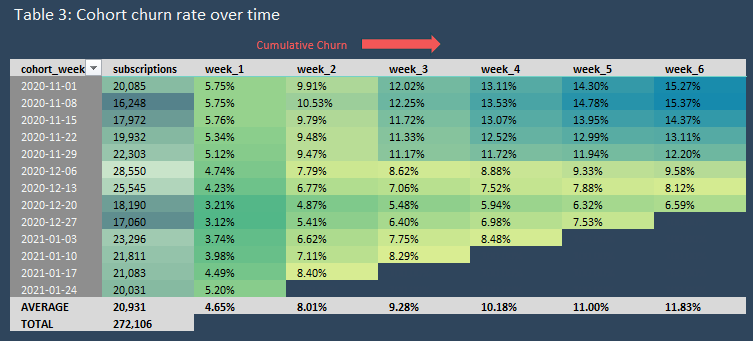

## ❓ Why Customer Cohort Analysis Matters

Customer cohort analysis helps businesses measure retention (how many customers stay) and churn (how many leave) over time. By grouping customers based on their sign-up date or first purchase, companies can:
- Identify trends: Spot whether newer customers stay longer than older ones.
- Improve retention: Pinpoint when customers typically leave and intervene.
- Optimize marketing: Measure which campaigns bring the most loyal customers.
- Boost revenue: Retaining customers is often cheaper than acquiring new ones.

---

## 📊 Project Description
This project analyzes weekly retention rates for user cohorts, tracking how many subscribers remain active over 6 weeks after their initial sign-up. The goal is to:
- Identify patterns in user drop-off.
- Provide actionable insights to reduce churn.
  
---  
## 📌 How to read a cohort table

From left to right, here’s what you’re looking at:

**2020-11-01**: This is the "cohort" - subscriptions that signed up for our product in a week starting at 2020-11-01.

**20,085**: This is the number of subscriptions in this cohort. So 20,085 subscriptions were acquired for our product in a week starting at 2020-11-01.

**94.25%**: This is the percentage of subscriptions that remained within the first week of signing up. Measured at the beginning of following week (2020-11-08). This implies that 5.75% of those 20,085 subscriptions cancelled.


---
## ✅ Visuals
We can display cohort-subscription data from several angles.

The total subscriptions for weekly cohorts and their activity over time.


The absolute numbers can be easily converted into retention rate.


What about Churn? Churn is just 1-Retention



What % of users churned on a particular week?


## 💡 Key insights & Recommendations

- In terms of **customer acquisition**, the best performing week was **2020-12-06**, with **28,550 new subscriptions**, folowed by a following week: **2020-12-13** with **25,545 new subscriptions**. If we compare the best performing week to the worst, we have a 75% increase in new subscriptions. 

  - **ACT**: Investigate what led to this particular behavior. It could be due to effective marketing campaign, sales promotion or other reason.

- The **highest Churn** happens during first few weeks since subscription (**~8%**). After initial week (week_0), measured at the begining of week_1 - average churn is **4.65%**, followed by a churn of **3.41%** in the following week. What constitutes a 'normal' churn can vary widely and what is acceptable for one business may be unacceptable for another. Industry benchmark, historical data and comparison with competitors would help evaluate current performance.
  - **ACT**: In case churn rate is too high during initial few weeks, it could be a sign of one or more problems:
    - Your product doesn’t match your customers’ expectations
    - Your onboarding process needs work
    - There’s an issue with how you’re acquiring/activating users
  
- **Matching customer expectations**: ask for cancelation reason whenever customer cancels their subscription. Once you gather data, evaluate trends.

- **Onboarding issue** can also be identified with previous step. If customers are cancelling because they don’t understand how to use your product, onboarding process needs to be evaluated and fixed.

- **Bad Acquisition model**: Some customers are destined to churn from the beginning because of the way they were acquired. You see this a lot when companies give deep discounts for new customers, or several months free. Discounts are a good way to get new customers quickly. But you’ll also need to accept that it can lead to high churn in the first few months as well. **Remember:** If you’re going to offer discounts, free trials or even go freemium, make sure it makes financial sense for your business.
  
- In general, the **retention rate improved** if we compare first several cohort weeks to the latter ones. After 4 weeks since initial cohort week, the **average weekly churn is below 1%** which signals a stable subscription retention which is the goal for any business.
  - **ACT:** look for ways to receive **feedback** from retained customers. Since they’ve stayed on with you, it could be a good idea to send these users a survey to ask what they like/dislike about your product. And use the feedback to improve your product and customer experience. **The goal is to find out what you can do to keep customers happy and pay you longer.**

**General insights**:
- Over the analysis period, a company received **272,106 subscriptions**. The most popular device was **Desktop (57.93%)**, followed by **Mobile (39.80%)**, while **Tablet** share was significantly lower **(2.27%)**.
- Although users come from a wide range of countries accross the globe (109) , the majority of subscriptions come from **United States (43.86%)**. Followed by **India (9.39%)** and **Canada (7.5%)**. It may be more preferable to **focus on STAR** regions, when performing cohort analysis. 

## 🛠️ Key Features & Functionality

Excel dashboard provides dynamic view on subscription data.

Uers can use filters to slice the data for their needs.


## 🗄️ Data Model & ETL

Key data parameters:

- Total number of records (subscriptions): 274,362
- Unique users: 270,154
- Earliest subscription_start: 2020-11-01(Sunday)
- Latest subscription_start/end: 2021-01-31 (Sunday)
- There are three subscription categories: desktop, mobile, tablet
- There are 2,205 records where country = '(not set)'
- Start of the week: Sunday

### SQL code with comments

The code is written without hardcoded values, allowing it to adapt to constantly changing data.

```sql
-- Use a CTE to find the maximum start date once
WITH subscription_max_date AS (
  SELECT MAX(subscription_start) AS max_start_date
  FROM `tc-da-1.turing_data_analytics.subscriptions`
),

modified_subscriptions AS (
  SELECT
    s.*,
    DATE_TRUNC(s.subscription_start, WEEK) AS start_week,
    COALESCE(DATE_TRUNC(s.subscription_end, WEEK), DATE('2099-01-01')) AS end_week,
    
    -- Calculate the subscription length in weeks
    DATE_DIFF(
      COALESCE(DATE_TRUNC(s.subscription_end, WEEK), DATE('2099-01-01')),
      DATE_TRUNC(s.subscription_start, WEEK),
      WEEK
    ) AS subscription_length_weeks,
    
    -- Boolean indicator whether a subscription week has a full week of data
    DATE_DIFF(
      m.max_start_date, 
      DATE_TRUNC(s.subscription_start, WEEK), 
      WEEK
    ) >= 1 AS is_full_week
    
  FROM 
    `tc-da-1.turing_data_analytics.subscriptions` AS s
  -- CROSS JOIN makes the single max_start_date value available to every row
  CROSS JOIN 
    subscription_max_date AS m
),

-- Find the maximum full week to ensure we do not cross it.
date_params AS (
  SELECT 
    DATE_TRUNC(MAX(subscription_start), WEEK) AS max_week
  FROM modified_subscriptions
  WHERE is_full_week = TRUE
),

cohort_table AS (
    SELECT
      start_week,
      -- Calculate number of subscriptions for each cohort
      COUNT(*) AS cohort_size,
      -- Because we evaluate full weeks, each cohort will have a first week count. Use subscription lenght to identify it.
      COUNTIF(subscription_length_weeks >= 1) AS week_1_count,
      -- For the most recent cohort, set week_2_count to NULL as the data is not yet available. Otherwise perform the count.
      CASE WHEN DATE_DIFF(max_week, start_week, WEEK)  = 0 THEN NULL ELSE COUNTIF(subscription_length_weeks >= 2) END AS week_2_count,
      -- This calculates Week 3 retention. A cohort must be at least 3 weeks old for this to be a valid metric.
      -- The condition `DATE_DIFF(...) <= 1` checks if the cohort is one of the two most recent complete cohorts.
      -- If it is, we set the value to NULL because not enough time has passed to measure 3 weeks of retention.
      -- This prevents showing a misleading 0 for these newer groups. 
      CASE WHEN DATE_DIFF(max_week, start_week, WEEK) <= 1 THEN NULL ELSE COUNTIF(subscription_length_weeks >= 3) END AS week_3_count,
      CASE WHEN DATE_DIFF(max_week, start_week, WEEK) <= 2 THEN NULL ELSE COUNTIF(subscription_length_weeks >= 4) END AS week_4_count,
      CASE WHEN DATE_DIFF(max_week, start_week, WEEK) <= 3 THEN NULL ELSE COUNTIF(subscription_length_weeks >= 5) END AS week_5_count,
      CASE WHEN DATE_DIFF(max_week, start_week, WEEK) <= 4 THEN NULL ELSE COUNTIF(subscription_length_weeks >= 6) END AS week_6_count,
    FROM modified_subscriptions, date_params
    WHERE is_full_week = TRUE
    GROUP BY start_week, max_week
)

SELECT * FROM cohort_table

